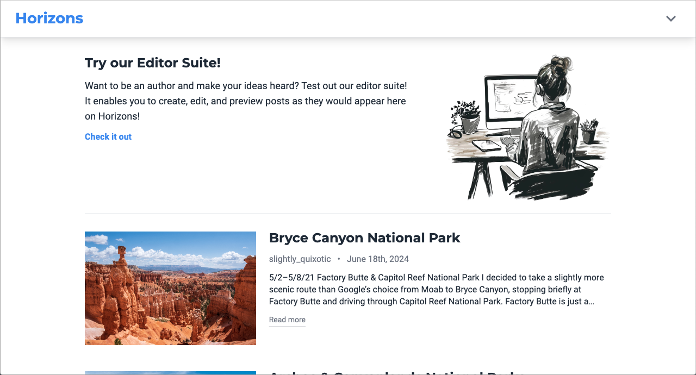
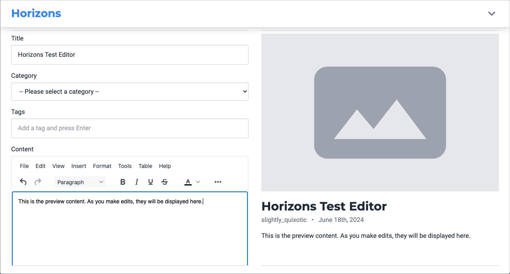
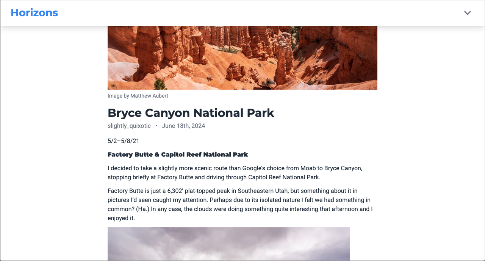

# Blog Client

In-progress front end for the Horizons blogging platform project. Built with TypeScript, React, and Tailwind CSS.

**[Click here to view the live site](https://horizons-ma.pages.dev)**  
**[Click here to try out the editor suite](https://horizons-ma.pages.dev/create-post)**  
**[Click here to see the GitHub repo for the back end](https://github.com/matthewaubert/blog-api)**

## How to Use

1. [Head to the live site](https://horizons-ma.pages.dev) on any device (mobile, tablet, or desktop – it doesn't matter).
1. Scroll down past the splash page to check out all the awesome blog posts written by Horizon's authors.
1. [Check out the editor suite](https://horizons-ma.pages.dev/create-post) if you'd like to try creating your own posts. You're welcome to play around with it to see how it works, but in order to submit a real post, you'll have to [create an account](https://horizons-ma.pages.dev/signup) and [verify your email address](https://horizons-ma.pages.dev/become-author).

## Project Objectives

This project is being built in order to practice implementing the following skills:
- Build a front end powered by an API-only back end
- Make `GET`, `POST`, `PUT`, `PATCH`, and `DELETE` requests on API endpoints
- Implement user authentication with [JSON web tokens](https://github.com/auth0/node-jsonwebtoken)
- Build a CMS with a rich text editor for authors to create and manage their posts

## Technologies Used

### Languages
- TypeScript / JavaScript
- CSS
- HTML

### Frameworks/Libraries and Tools
- React
- Tailwind CSS
- Vite – for scaffolding and bundling my app
- Git (obviously)

### Libraries
- [date-fns](https://date-fns.org/) – for formatting JavaScript dates
- [He](https://www.npmjs.com/package/he) – for decoding HTML entities
- [html-react-parser](https://www.npmjs.com/package/html-react-parser) – for parsing HTML strings into React elements
- [jwt-decode](https://www.npmjs.com/package/jwt-decode) – for decoding JSON web tokens
- [LDRS](https://uiball.com/ldrs/) – for loading indicators
- [Material Design Icons](https://pictogrammers.com/docs/library/mdi/getting-started/react/) – for SVG icon components
- [React Router](https://reactrouter.com/en/main) – for handling client-side routing
